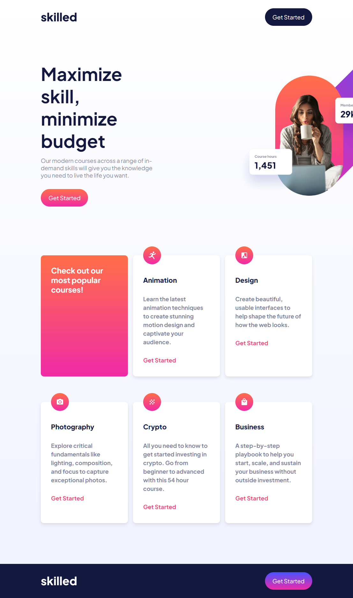

# Frontend Mentor - Skilled e-learning landing page solution

This is a solution to the [Skilled e-learning landing page challenge on Frontend Mentor](https://www.frontendmentor.io/challenges/skilled-elearning-landing-page-S1ObDrZ8q).

### The challenge

Users should be able to:

- View the optimal layout depending on their device's screen size
- See hover states for interactive elements

### Screenshot

### Links

- Solution URL: [My solution URL](https://github.com/ahmedattlam10/Skilled-e-learning-landing-page)
- Live Site URL: [My live site URL](https://ahmedattlam10.github.io/Skilled-e-learning-landing-page/)

### Built with

- Semantic HTML5 markup
- CSS custom properties
- Flexbox
- CSS Grid
- Mobile-first workflow

## Author

- Website - [github-profile](https://github.com/ahmedattlam10)
- Frontend Mentor - [FM-profile](https://www.frontendmentor.io/profile/ahmedattlam10)
